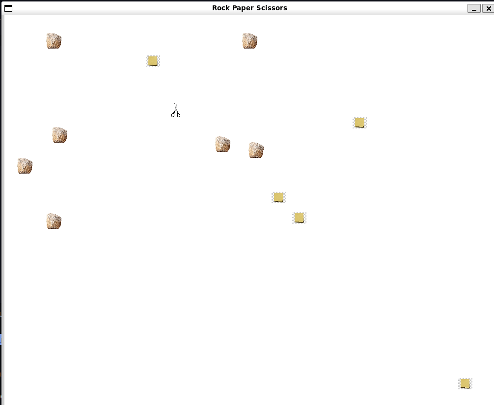

# RPS
A simple Non-Interactive Fun game
Just vote for any one and hope it wins


# How it Works
Random stone, paper, scissors are generated. If a same objects collide nothing happens otherwise the looser of the pair gets turned into the winner one (Looser and winner are decided according to classic Rock-Paper-Scissors game)


# Example




# How to run

If you have SFML and cpp installed in you computer just run the below commands

```
make compile
make run
```

Otherwise first,

```
sudo apt-get install libsfml-dev
sudo apt-get install build-essential
```
further info can be found in [this stackoverflow link](https://stackoverflow.com/questions/30696114/how-to-install-sfml-in-ubuntu) 